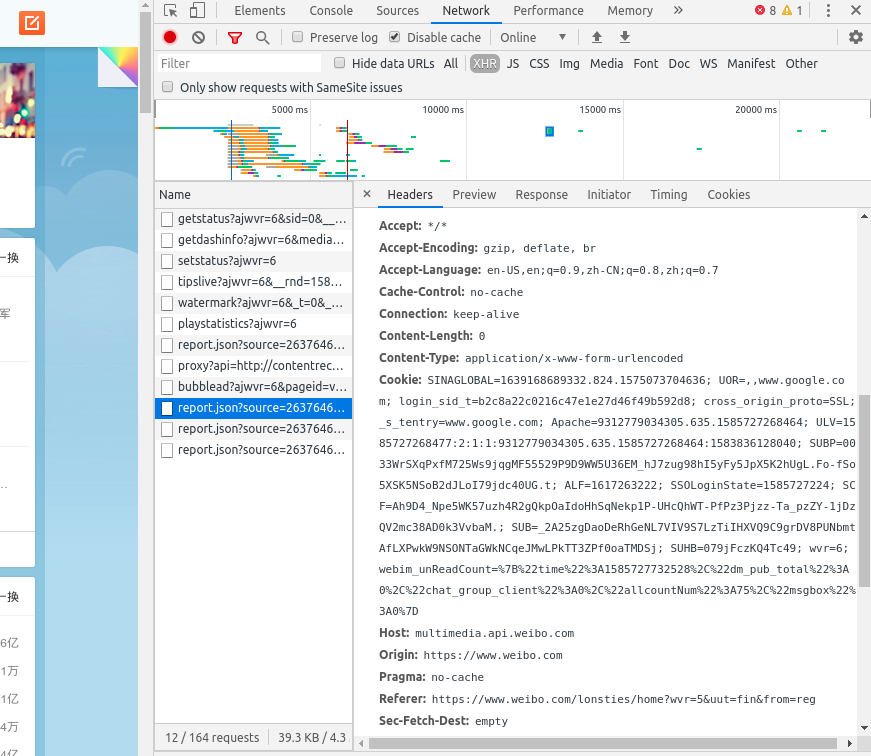

## 获取网页版微博的 cookie：

1. 前往微博主页 [https://www.weibo.com/](https://www.weibo.com/)，并使用个人账号完成登录；

2. 以 Google Chrome 浏览器为例，按 「F12」打开开发者模式，依次点击「Network」→「XHR」，然后按「F5」刷新，在 XHR 记录中随便选中一条，点开 Headers，复制 Request Headers 中的 Cookie 值，将其粘贴在根目录的 [cookie](../cookie) 文件中，覆盖原内容即可。

